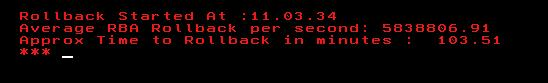

# Estimating UR ROLLBACK completion time.

## Problem
Ever Caught is a situation where you are called upon to do the analysis of this situation

```
DSNR048I  =DBXX- DSNRBMON UR BACKOUT PROCESSING LOG  186             
RECORD                                                               
          AT RBA 0000000003307D661C80 TO RBA 0000000003304A352927 FOR
           CORRELATION NAME = ENTRXXXX0005                           
          CONNECTION ID  = CIUXXXX                                  
          LUWID = XXXXX.LUDBU4.DA08606DF146 = 7587                 
          PLAN NAME = XXX0403                                        
          AUTHID = DEVXXXX                                           
          END USER ID = *                                            
          TRANSACTION NAME = ENTRME06                                
          WORKSTATION NAME = *    


DSNR048I  =DBXX- DSNRBMON UR BACKOUT PROCESSING LOG  206              
RECORD                                                                
          AT RBA 0000000003304F562000 TO RBA 0000000003304A352927 FOR 
           CORRELATION NAME = ENTRXXXX0005                            
          CONNECTION ID  = CIU7XXX                                   
          LUWID = XXXXX.LUDBU4.DA08606DF146 = 7587                  
          PLAN NAME = XXX0403                                         
          AUTHID = DEVXXX                                            
          END USER ID = *                                             
          TRANSACTION NAME = ENTRXXX                                 
          WORKSTATION NAME = * 
       
 ```
 
This is situation when UNCOMMITED UR undergoes a ROLLBACK.

When a UR undergoes a ROLLBACK it holds Xclusive locks on a objects involved in the UR ,which causes objects to be unavailable for other transactions.

#### What if this UR is long running and event happened on PRODUCTION ? 

It can make many nervous as the objects involved in the UR are unavailable which can cause timeouts for other transactions interested in same objects. When timeouts occur for extended amount of time it impacts business.

#### **Scenario** : 
Recently it happened a Db2 records Purge job ran for 5 hours and written 100 million log records without a commit and it reached a point where it started impacting a IMS onlines . So business decided to cancel this long running UR.Operation team went ahead and cancelled the job thinking once cancelled business will resume normally totally unaware Cancelling will initiate a Rollback in Db2 and to rollback 100 million records it will going to take time before objects can be released.
Job was cancelled with no relief . Business Opened P1 after waiting for 45 minutes and seeing several complaints from call center , Db2 team was involved now and questions were thrown. Db2 team identified there is thread which is undergoing ROLLBACK .In this case fortunately rollback completed within 20 minutes after joing the call .

#### But how to decide to allow ROLLBACK to complete or CANCEL the recovery of thread ?

Cancelling ROLLBACK causes objects to undergo RECP restrictive state which will need manual recover which I am not discussing here.

Allowing ROLLBACK to complete Db2 will take care of Recovery and bring objects in consistent state.

## Solution

If we can somehow **guess the time for ROLLBACK completion it will help our judgement** what should be next set of actions allow or cancel !

From the messages appearing in Db2 logs message _"DSNR048I"_ can help us to predict how much time ROLLBACK process will take.

Attached is the rexx code(macro) which I wrote to predict time a rollback process to complete. It calculates a avg ROLLBACK rate and suggest time it will take to read through original URID based on average rollback rate.

I tested this on 3-4 cases which were seen recently and it predicts a close enough completion time , from 5-10 samples of continuous DSNR048I message info.

Hope this finds meaning for your environment also.


## USAGE

- Upload ROLLRATE REXX macro to your available REXX Dataset in SYSEXEC or SYSPROC .
- Use either of the option
       -  Option 1                          
          1. Open Db2 MSTR STC in SDSF      
          2. Issue SE JESMSGLG in SDSF              
          3. Identify Beg URID from DSNR048I message.
          4. On Command Line issue                   
	          -  rollrate <URID> 

          
       -  Option 2                          
          1. XDC  Db2 MSTR JESMSGLG      
          2. Identify Beg URID from DSNR048I message.
          3. On Command Line issue                   
	          -  rollrate <URID> 
          
## Output
   
	
	


